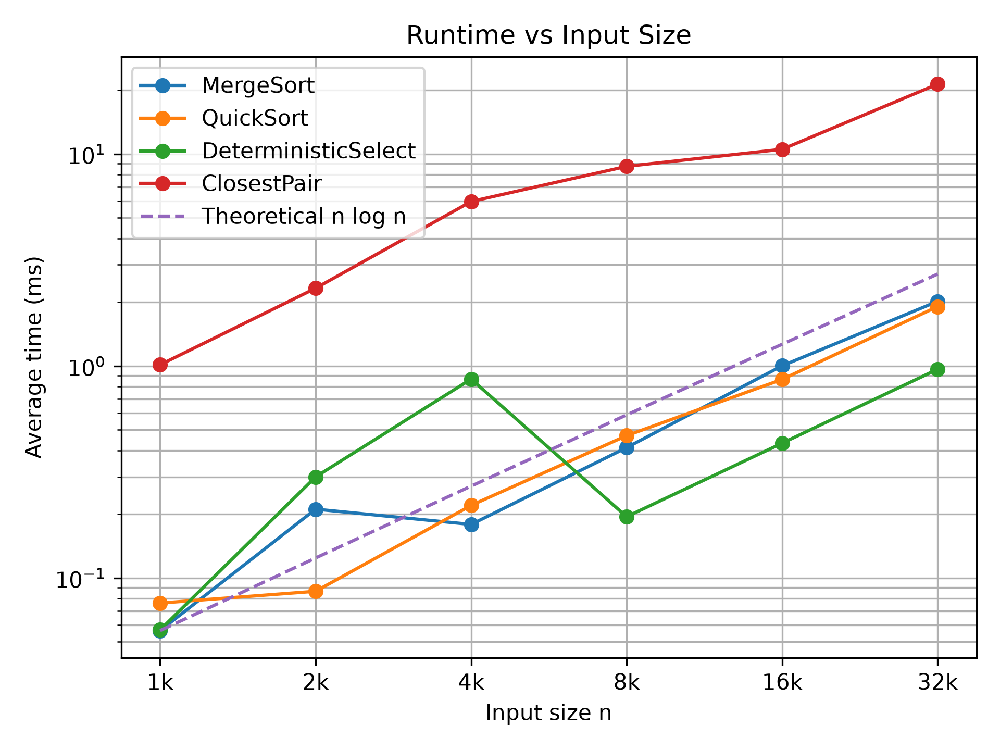
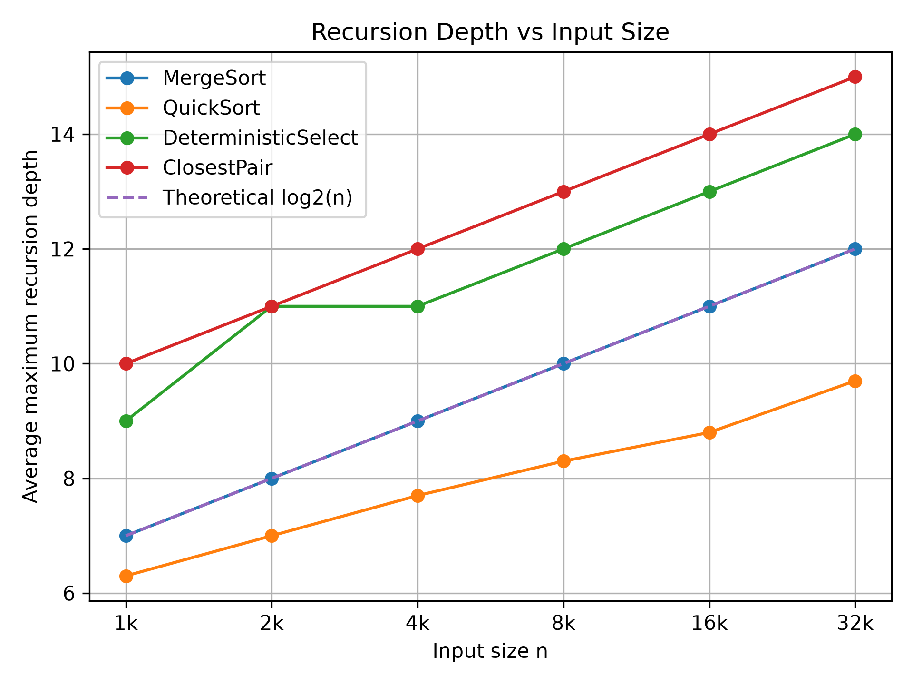
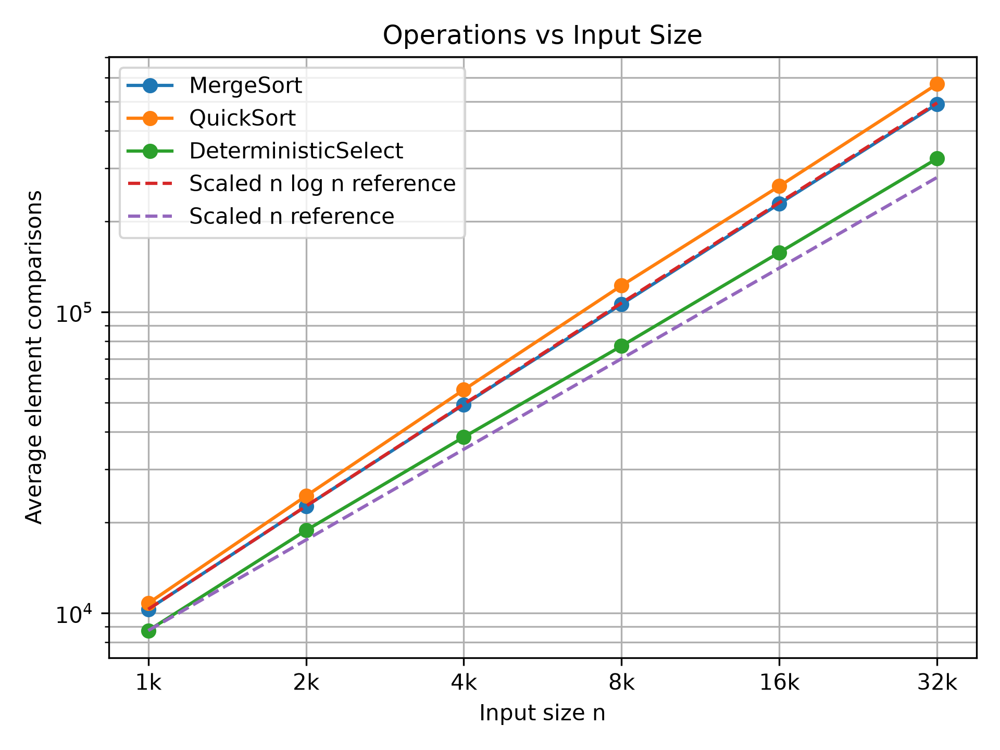
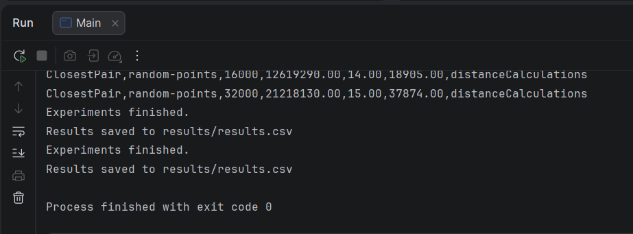
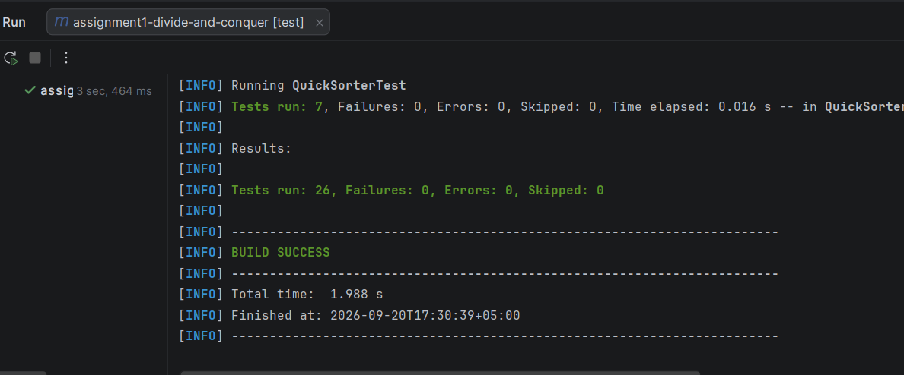
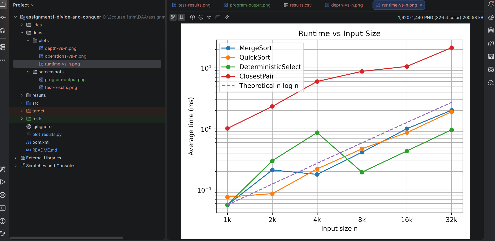

# Assignment 1: Divide-and-Conquer Algorithm Analysis

## Overview

This project implements and analyzes four divide-and-conquer algorithms:

- MergeSort
- Randomized QuickSort
- Deterministic Select (Median-of-Medians)
- Closest Pair of Points

The goal is to compare theoretical complexity with practical performance using execution time, recursion depth, and algorithmic operation counts.

---

## 1. MergeSort

MergeSort divides the array into two halves, recursively sorts both halves, and merges them.

Implementation features:

- linear merge
- reusable auxiliary buffer
- Insertion Sort cutoff (`CUTOFF = 16`)
- comparison counting
- recursion-depth tracking

### Recurrence

```text
T(n) = 2T(n/2) + Θ(n)
```

Using the Master Theorem:

```text
a = 2, b = 2, d = 1
a = b^d
```

Therefore:

```text
T(n) = Θ(n log n)
```

### Complexity

| Metric | Complexity |
|---|---|
| Time | Θ(n log n) |
| Auxiliary space | O(n) |
| Recursion depth | O(log n) |

---

## 2. Randomized QuickSort

QuickSort selects a random pivot and partitions the array in-place.

The implementation recursively processes only the smaller partition and processes the larger partition iteratively.

### Typical recurrence

For approximately balanced partitions:

```text
T(n) = 2T(n/2) + Θ(n)
```

Using the Master Theorem:

```text
T(n) = Θ(n log n)
```

### Worst case

```text
T(n) = T(n - 1) + Θ(n)
```

Therefore:

```text
T(n) = O(n²)
```

### Complexity

| Metric | Complexity |
|---|---|
| Typical time | O(n log n) |
| Worst-case time | O(n²) |
| Auxiliary space | O(log n) |
| Recursion stack | O(log n) |

The stack remains small because only the smaller partition is processed recursively.

---

## 3. Deterministic Select

Deterministic Select finds the k-th smallest element without fully sorting the array.

The algorithm:

1. Splits elements into groups of five.
2. Finds each group median.
3. Recursively finds the median of medians.
4. Uses it as the pivot.
5. Partitions the array.
6. Continues only in the partition containing the required element.

### Recurrence

A standard worst-case recurrence is:

```text
T(n) ≤ T(n/5) + T(7n/10) + Θ(n)
```

Using Akra-Bazzi intuition, the recursive subproblems contain only a fraction of the original input and the total non-recursive work is linear.

The amount of work decreases geometrically across recursion levels, giving:

```text
T(n) = Θ(n)
```

### Complexity

| Metric | Complexity |
|---|---|
| Worst-case time | Θ(n) |
| Auxiliary space | O(log n) |

---

## 4. Closest Pair of Points

Closest Pair finds the minimum Euclidean distance between any two points.

The implementation:

1. Sorts points by x-coordinate.
2. Maintains points in y-coordinate order.
3. Divides the points into two halves.
4. Solves both halves recursively.
5. Builds a strip around the dividing line.
6. Checks candidate points in y-order.

Maintaining y-order avoids sorting the strip again at every recursion level.

### Recurrence

After the initial sorting step:

```text
T(n) = 2T(n/2) + Θ(n)
```

Using the Master Theorem:

```text
T(n) = Θ(n log n)
```

The initial sorting also requires `Θ(n log n)`, so the complete algorithm remains:

```text
Θ(n log n)
```

### Complexity

| Metric | Complexity |
|---|---|
| Time | Θ(n log n) |
| Auxiliary space | O(n) |
| Recursion depth | O(log n) |

---

# Testing

JUnit 5 is used for correctness testing.

### MergeSort and QuickSort

Results are compared with:

```java
Arrays.sort()
```

Tests include random, sorted, reverse-sorted, duplicate-heavy, empty, and single-element arrays.

### Deterministic Select

The result is compared with:

```text
Arrays.sort(array)[k]
```

At least 100 randomized tests are performed.

### Closest Pair

The divide-and-conquer implementation is compared with an `O(n²)` brute-force implementation for datasets up to 2,000 points.

---

# Experimental Setup

Input sizes:

```text
1,000
2,000
4,000
8,000
16,000
32,000
```

Each size doubles systematically.

For every configuration:

```text
3 JVM warm-up runs
10 measured runs
```

The final values are averages of the measured runs.

Array input types:

- random
- sorted
- reverse-sorted
- duplicate-heavy

Measurements:

| Algorithm | Additional metric |
|---|---|
| MergeSort | comparisons |
| QuickSort | comparisons |
| Deterministic Select | comparisons |
| Closest Pair | distance calculations |

Execution time is measured using:

```java
System.nanoTime()
```

Complete results are stored in:

```text
results/results.csv
```

---

# Experimental Results

## Random inputs

| n | MergeSort (ms) | QuickSort (ms) | Select (ms) | Closest Pair (ms) |
|---:|---:|---:|---:|---:|
| 1,000 | 0.065 | 0.074 | 0.078 | 1.059 |
| 2,000 | 0.228 | 0.110 | 0.083 | 1.961 |
| 4,000 | 0.299 | 0.174 | 0.096 | 5.568 |
| 8,000 | 0.405 | 0.418 | 0.207 | 13.973 |
| 16,000 | 0.888 | 0.952 | 0.486 | 17.961 |
| 32,000 | 1.961 | 1.904 | 0.892 | 24.121 |

Runtime contains some irregularities because real JVM execution is affected by JIT compilation, cache behavior, operating-system scheduling, and other runtime effects.

---

## Recursion Depth

Random-input results:

| n | MergeSort | QuickSort | Select | Closest Pair |
|---:|---:|---:|---:|---:|
| 1,000 | 7.0 | 6.4 | 9.0 | 10.0 |
| 2,000 | 8.0 | 7.0 | 11.0 | 11.0 |
| 4,000 | 9.0 | 7.2 | 11.0 | 12.0 |
| 8,000 | 10.0 | 8.0 | 12.0 | 13.0 |
| 16,000 | 11.0 | 9.0 | 13.0 | 14.0 |
| 32,000 | 12.0 | 9.6 | 14.0 | 15.0 |

MergeSort and Closest Pair increase by approximately one recursion level whenever `n` doubles, which is consistent with logarithmic recursion depth.

---

## Effect of Input Type at n = 32,000

| Input | MergeSort (ms) | QuickSort (ms) | Select (ms) |
|---|---:|---:|---:|
| Random | 1.961 | 1.904 | 0.892 |
| Sorted | 0.486 | 0.892 | 0.435 |
| Reverse | 0.803 | 0.990 | 0.568 |
| Duplicates | 1.052 | 48.891 | 0.646 |

The largest difference is visible in QuickSort on duplicate-heavy input.

At `n = 32,000`:

```text
Random QuickSort:
~565,781 comparisons

Duplicate-heavy QuickSort:
~51,305,106 comparisons
```

---

# Plots

## Runtime vs Input Size



The dashed `n log n` curve is a scaled theoretical reference. It is used to compare growth shape rather than absolute execution time.

---

## Recursion Depth vs Input Size



The dashed `log2(n)` curve is a scaled theoretical reference.

MergeSort follows logarithmic depth very closely.

---

## Operations vs Input Size



This graph compares element comparisons for MergeSort, QuickSort, and Deterministic Select.

The measured results show:

- MergeSort follows approximately `n log n`.
- Randomized QuickSort on random input also follows approximately `n log n`.
- Deterministic Select is closer to linear `n` growth.

Operation counts are more stable than runtime because they are not affected by JVM timing noise.

---

# Discussion

## Do the experimental results match theoretical complexity?

Generally, yes.

MergeSort comparisons follow approximately `n log n`, while Deterministic Select is closer to linear growth.

QuickSort behaves approximately like `n log n` on normal inputs but can degrade strongly for unfavorable input distributions.

Runtime is less smooth than operation counts because real execution depends on the JVM and hardware.

---

## How does input structure affect performance?

MergeSort maintains `Θ(n log n)` complexity for all tested input types, although its exact comparison count changes.

Randomized QuickSort performs well on random, sorted, and reverse-sorted inputs.

Duplicate-heavy input performs much worse with the implemented partition strategy because many elements equal to the pivot repeatedly remain in large partitions.

---

## Why does smaller-first recursion help QuickSort?

After partitioning, only the smaller side is processed recursively.

The smaller partition can contain at most about half of the current elements.

Therefore the recursive chain decreases approximately as:

```text
n
n/2
n/4
n/8
...
```

This keeps stack depth at:

```text
O(log n)
```

The larger partition is processed with a loop instead of another recursive call.

---

## Why does Median-of-Medians guarantee O(n)?

Groups of five are used to choose a pivot that cannot be consistently extremely bad.

The pivot guarantees that a constant fraction of the elements can be discarded.

This gives the recurrence:

```text
T(n) ≤ T(n/5) + T(7n/10) + Θ(n)
```

The recursive fractions shrink sufficiently fast, while grouping and partitioning perform linear work.

Therefore the total worst-case running time is:

```text
Θ(n)
```

---

## Why is divide-and-conquer Closest Pair faster than O(n²)?

Brute force checks every pair of points:

```text
O(n²)
```

The divide-and-conquer algorithm splits the points into two halves and recursively solves each half.

Only points close to the dividing line must be checked again.

Because the strip is kept in y-order, only nearby candidates need to be considered.

This produces linear combine work at each recursion level:

```text
T(n) = 2T(n/2) + Θ(n)
```

which gives:

```text
Θ(n log n)
```

---

## What practical factors affect performance?

Real execution time can be influenced by:

- JVM warm-up and JIT compilation
- CPU cache behavior
- garbage collection
- memory allocation
- operating-system scheduling
- background applications

This is why warm-up runs and repeated measurements are used.

Operation counts are useful because they are less affected by these factors.

---

# Reflection

This assignment helped me understand how divide-and-conquer algorithms are implemented and how recursive code can be described using recurrence relations. I also learned how the Master Theorem and Akra-Bazzi intuition connect recursive structure with asymptotic complexity.

The most challenging parts were controlling QuickSort recursion, implementing Median-of-Medians, and maintaining both x-order and y-order in Closest Pair. The experiments also showed that theoretical complexity describes growth rather than exact execution time, and that recursion depth and total running time are different properties.

---

# Project Structure

```text
assignment1-divide-and-conquer/
├── src/
│   ├── Main.java
│   ├── MergeSorter.java
│   ├── QuickSorter.java
│   ├── DeterministicSelector.java
│   ├── ClosestPairSolver.java
│   ├── Point.java
│   └── Experiment.java
├── tests/
│   ├── MergeSorterTest.java
│   ├── QuickSorterTest.java
│   ├── DeterministicSelectorTest.java
│   └── ClosestPairSolverTest.java
├── docs/
│   ├── plots/
│   └── screenshots/
├── results/
│   └── results.csv
├── plot_results.py
├── README.md
├── pom.xml
└── .gitignore
```

---

# Screenshots

## Program Output



## Test Results



## Plots / Results



---

# Running the Project

Run:

```text
src/Main.java
```

to execute the experiments and generate:

```text
results/results.csv
```

Run the JUnit tests through IntelliJ IDEA or Maven.

Generate plots with:

```bash
python plot_results.py
```

---

# AI Usage Disclosure

AI tools were used for explanations, code review, testing guidance, and documentation support.